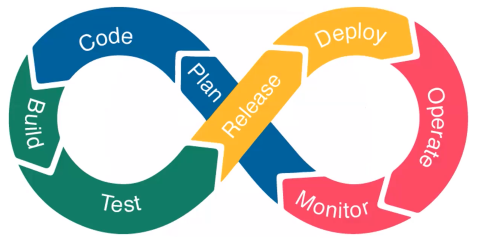

# Hi There 👋
My name is David Alejandro, I’m preparing myself to be a DevOps engineer and study every day about different topics that could be interesting to you🧐. I’ll try to be the clearest possible in each topic and let the bibliography if you want to search.

## What is DevOps?
There are a lot of definitions about what is DevOps, but for me and what I have been researching it is a culture that starts with the objective to break the Wall between Developers and Operators but now DevOps is a methodology of work that we can use in all the product cycle to make faster and complete deployments, where we do guidelines to make a control about how we are progressing and where we can do better.

## C.A.L.M.S. Framework
The CALMS framework is where we can see the DevOps culture in a more clear form.

### 1. Culture 📖
   - Responsability End to End.
   - Colaboration.
   - Continuous improvement.
   - Automation
   - Fault acceptance
   - Unite teams and experiences
### 2. Automation 🤖
   - Eliminate manual processes.
   - Eliminate repetitive processes.
   - Everything as a code.
   - Continuous Delivery.
   - Toil concept.
### 3. Lean 🚮
   - Limit the accumulation of waste.
   - Limit the WIP (Work in process)
   - Reduce the size of gaps.
   - Reduce the number of handoffs.
   - Identify the restrictions and concerns.
   - Eliminate all the wast of our value flow.
### 4. Measurement 📏
   - LeadTime: When the ticket is created until it ends.
   - Process time: When the ticket started until I finished it.
   - Change Frequency: How frequent are the changes.
   - Change Failure Rate: Failure rate.
   - MTTR: Mean time to repair (How long it takes us to solve the problems).
### 5. Sharing 🗣
   - Break down silos to share between different areas.
   - Share knowledge
   - Better practices
   - Processes

## DevOps Lifecycle
The DevOps life cycle is the steps that the source code of software goes through to be deployed in an environment.

### 1. Plan 
  - Define a minimum set of functionalities that add value in each iteration and the acceptance criteria to be met. Communication between the business and the development team is key.
### 2. Code
  - After defining the plan, we proceed to code the application according to the requirements agreed with the client. Here you start to develop the project software. These developments proceed in small processes in the development cycle.
At the same time, you begin to define the tests that you must perform on your piece to ensure that it meets the functional requirements. On the part of operations, they begin the construction of the automation necessary for and of the software. The person in charge of the project ensures that the development team is reinforced with the use of security tools and possible attacks that this new piece of software may face.
### 3. Build
### 4. Test
### 5. Release
### 6. Deploy
### 7. Operate
### 8. Monitor

## Bibliography
  - https://www.kranio.io/blog/introduccion-al-ciclo-de-vida-de-devops#:~:text=El%20ciclo%20de%20vida%20de,destino%20y%20ser%20una%20aplicaci%C3%B3n.
  - https://www.simform.com/blog/devops-lifecycle/#section2
